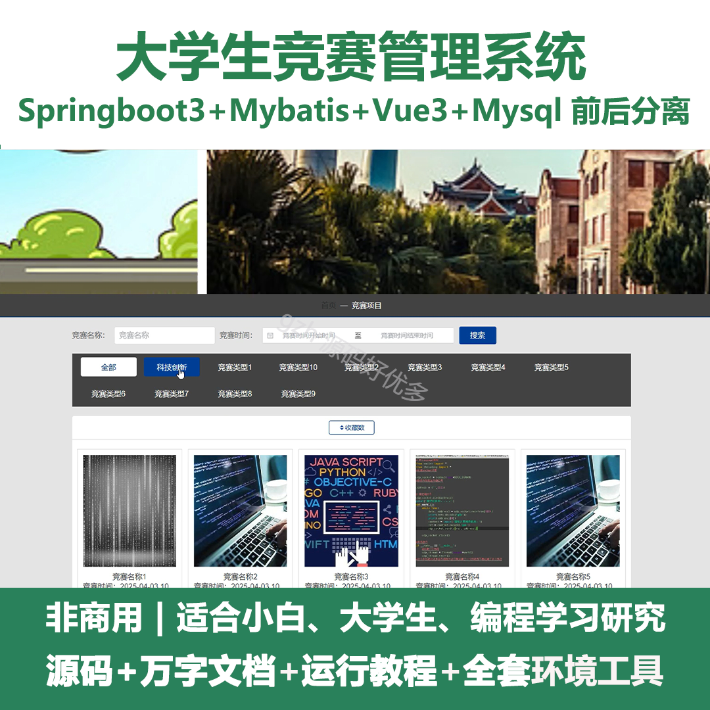
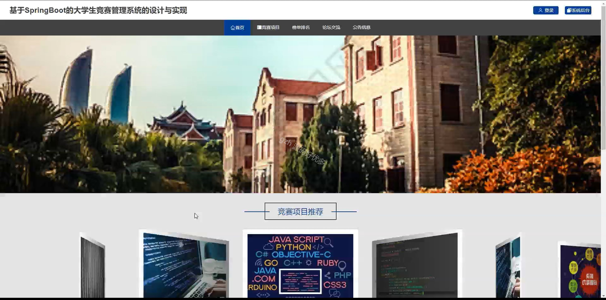
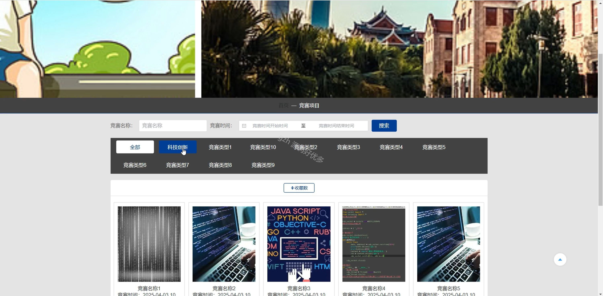
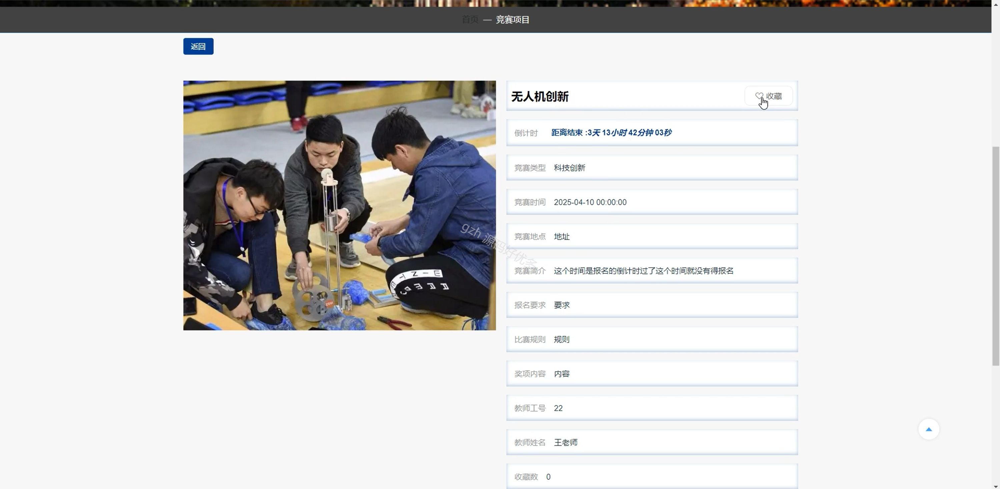
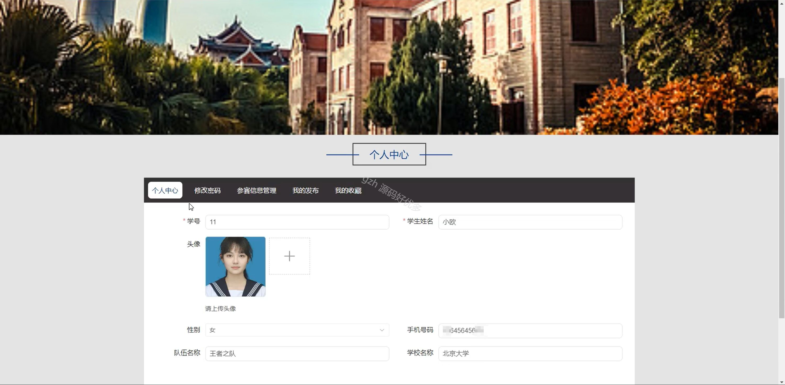
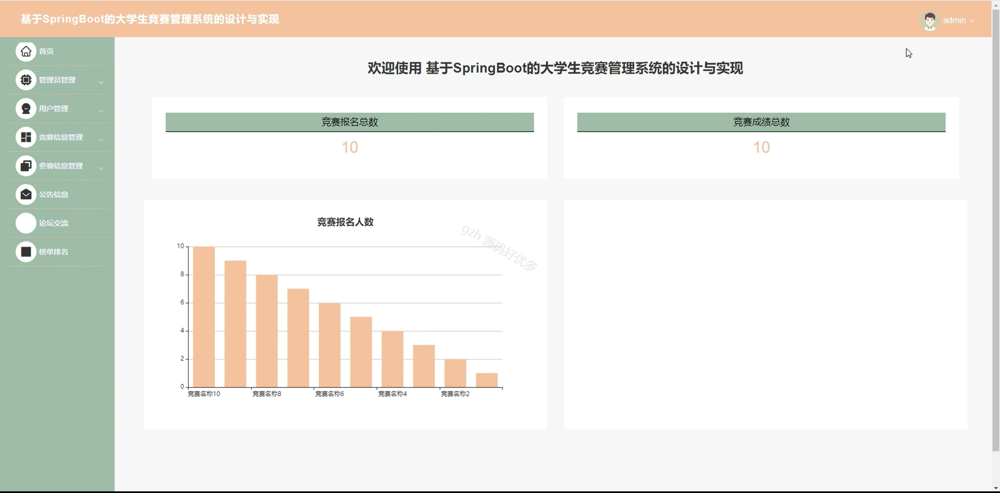
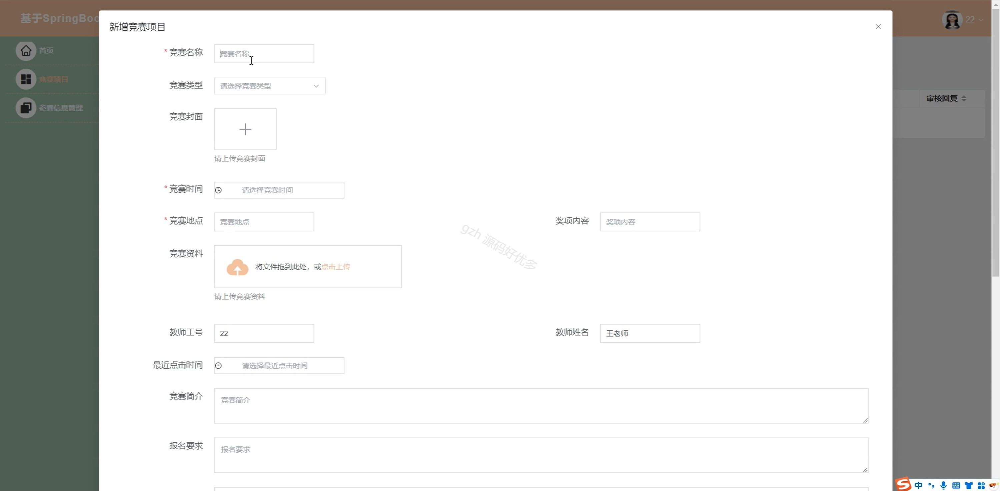
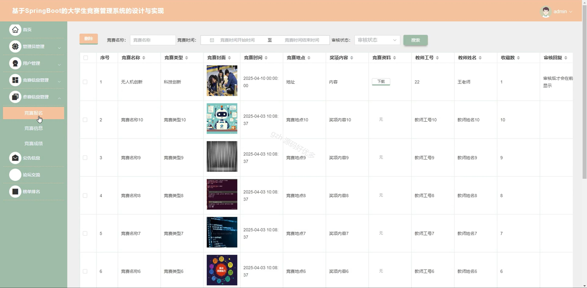
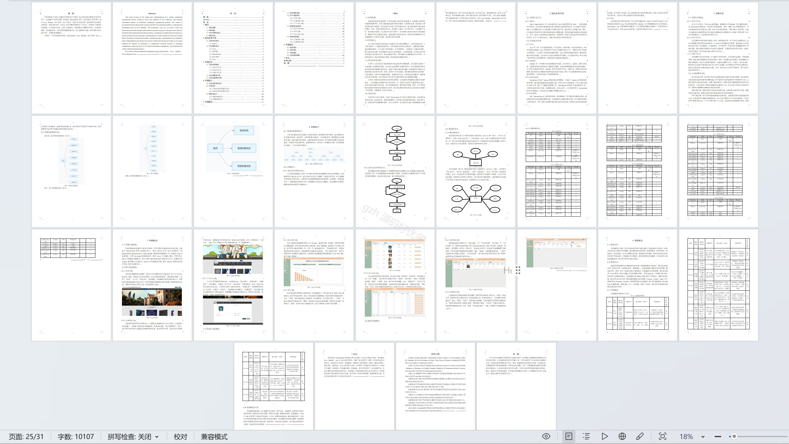

# springbootA279D
springbootA279D大学生竞赛管理系统+LW
 
## 查看主页获取源码

### 一、关键词
竞赛信息管理、参赛信息管理、榜单排名

### 二、作品包含
源码+数据库+设计文档万字+全套环境和工具资源+本地部署教程

### 三、项目技术
前端技术：Html、Css、Js、Vue3.0、Element-plus 
后端技术：Java、SpringBoot3.0、MyBatis

### 四、运行环境（以下版本亲测，其他版本未知，请自测）
开发工具：IDEA/eclipse  + VSCODE

数据库：MySQL5.7（最低要5.7版本）

数据库管理工具：Navicat10以上版本

环境配置软件： JDK17 + Maven3.6.3

前端Nodejs：20

浏览器：谷歌浏览器

### 五、项目介绍
项目编号：springbootA279D

大学生竞赛管理系统能整合竞赛信息发布等环节，高效规范地助力高校完成各类竞赛的全流程管理。

角色：管理员、用户、教师

管理员功能：首页、管理员管理、用户管理、竞赛信息管理、参赛信息管理、公告信息、论坛交流、榜单排名。

教师功能：首页、竞赛项目、参赛信息管理。

用户功能：首页、竞赛项目、榜单排名、论坛交流、公告信息、个人中心、修改密码、参赛信息管理、我的发布、我的收藏。

### 六、运行截图

